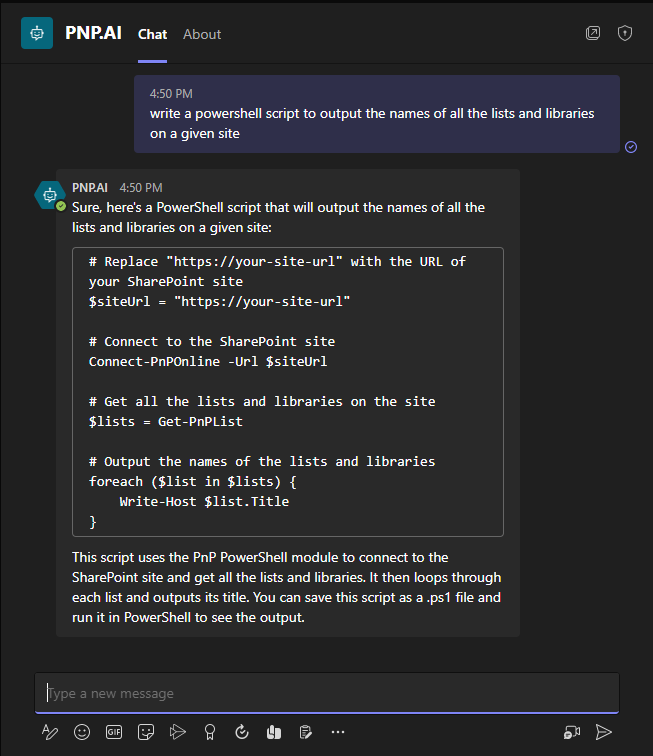

# Azure OpenAI ChatGPT 3.5 Turbo PNP.AI Conversation Bot

## Summary

This sample will help you create a Power Virtual Agent bot that you can connect to your existing Azure OpenAI Resource with a ChatGPT 3.5 Turbo deployment that is scoped to PNP content. (The bot's initial system message can be easily altered to update the bot's personality and goals)

This solution requires:

* Azure OpenAI Resource
* Azure OpenAI ChatGPT 3.5 Turbo Deployment
* Premium Power Automate License for utilizing HTTP Action

## Applies to

* [Microsoft Power Virtual Agents](https://docs.microsoft.com/power-virtual-agents/)
* [Microsoft Power Automate](https://docs.microsoft.com/power-automate/)

## Compatibility

## Authors

Solution|Author(s)
--------|---------
azure-openai-chatgpt-35-turbo-pnpai-bot | [Matt Jimison](https://github.com/mjimison) ([@mjimison](https://twitter.com/mjimison))

## Version history

Version|Date|Comments
-------|----|--------
1.0|March 23, 2023|Initial release

## Features

This bot utilizes a Fallback topic to ensure prompts entered by the user are passed to a Power Automate Flow that calls an Azure OpenAI ChatGPT 3.5 Turbo endpoint. The current solution utilizes ChatML to create a running history of the conversation that is passed to the API so that the bot has the context of the current conversation with the user.

Users can type 'Restart' to reset the conversation at anytime.

## Minimal Path to Awesome

* [Download](solution/pnpai_1_0_0_1.zip) the `.zip` from the `solution` folder
* Import the `.zip` file into your chosen Power Platform environment's Solution repository: **Select Environment** > **Solutions** > **Import solution** 
* Configure the environment variables for:
    * **AzureOpenAIAPIKey:** API Key to your Azure OpenAI resource
    * **AzureOpenAIAPIUrl:** URL to your Azure OpenAI ChatGpt 3.5 Turbo endpoint (this url should look similiar to https://**resourcename**.openai.azure.com/openai/deployments/**gpt**/completions?api-version=2022-12-01 where you are substituting your resource name and model name)
* After the import has suceeded, you can edit the bot by selecting it in your PowerApps Environment's 'Chatbots' list, and publish it once you are ready to share it

## Disclaimer

**THIS CODE IS PROVIDED *AS IS* WITHOUT WARRANTY OF ANY KIND, EITHER EXPRESS OR IMPLIED, INCLUDING ANY IMPLIED WARRANTIES OF FITNESS FOR A PARTICULAR PURPOSE, MERCHANTABILITY, OR NON-INFRINGEMENT.**

## Help

We do not support samples, but we this community is always willing to help, and we want to improve these samples. We use GitHub to track issues, which makes it easy for  community members to volunteer their time and help resolve issues.

If you encounter any issues while using this sample, [create a new issue](https://github.com/pnp/powerautomate-samples/issues/new?assignees=&labels=Needs%3A+Triage+%3Amag%3A%2Ctype%3Abug-suspected&template=bug-report.yml&sample=YOURSAMPLENAME&authors=@YOURGITHUBUSERNAME&title=YOURSAMPLENAME%20-%20).

For questions regarding this sample, [create a new question](https://github.com/pnp/powerautomate-samples/issues/new?assignees=&labels=Needs%3A+Triage+%3Amag%3A%2Ctype%3Abug-suspected&template=question.yml&sample=YOURSAMPLENAME&authors=@YOURGITHUBUSERNAME&title=YOURSAMPLENAME%20-%20).

Finally, if you have an idea for improvement, [make a suggestion](https://github.com/pnp/powerautomate-samples/issues/new?assignees=&labels=Needs%3A+Triage+%3Amag%3A%2Ctype%3Abug-suspected&template=suggestion.yml&sample=YOURSAMPLENAME&authors=@YOURGITHUBUSERNAME&title=YOURSAMPLENAME%20-%20).

---
