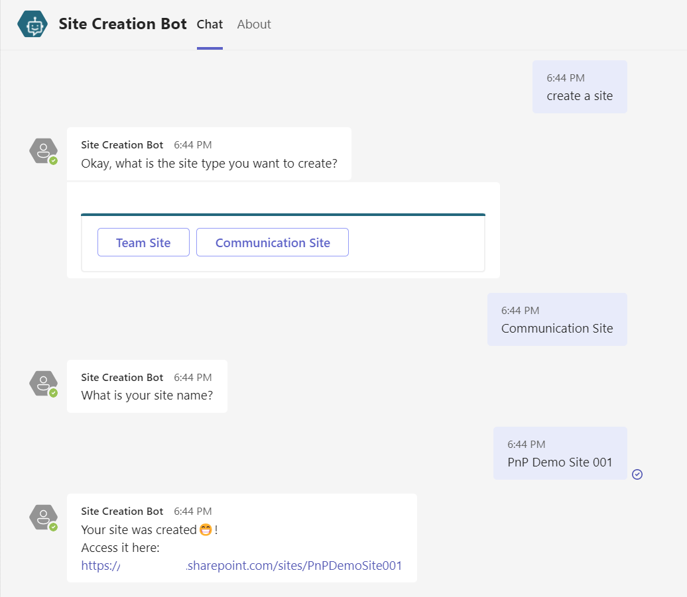

# SharePoint Site Creation Bot

## Summary

Sample Bot that creates a SharePoint Site by calling Power Automate and using Microsoft Graph/SharePoint Rest APIs. 

This bot can create either a blank Communication site or a blank Team site (Group connected).

This solution was built and targeted to be used in Dataverse for Teams.

## Applies to

* [Microsoft Power Virtual Agents](https://docs.microsoft.com/power-virtual-agents/)
* [Microsoft Power Automate](https://docs.microsoft.com/power-automate/)

## Compatibility

## Authors

Solution|Author(s)
--------|---------
sharepoint-site-creation-bot | [Michel Mendes](https://github.com/michelcarlo) ([@michelcarlo](https://twitter.com/michelcarlo))

## Version history

Version|Date|Comments
-------|----|--------
1.0|July 16, 2022|Initial release

## Features

This is a bot built and targeted to be used within a Dataverse for Teams environments. No premium licenses are required.

The bot is triggered by any of the phrases:
* Create a site
* Create a SharePoint site
* I want a site
* I want a SharePoint site
* Give me a site

You can then choose to create a Communication site or a Team site. 

After specifiying your site name, the bot will then trigger a Power Automate flow that handles the SharePoint site creation (part of the solution package).

Before creating the site, the flow checks if a site with the same destination URL exists. If it does not exist then if the site to be created is a Communication Site, it will use the SharePoint REST API to create it, if it is a Team site we use Microsoft Graph (using the Send an HTTP request - Preview action from the Office 365 Groups connector).

## Minimal Path to Awesome

* [Download](solution/SharePointSiteCreationBot_1_0_0_0.zip) the `.zip` from the `solution` folder
* Import the `.zip` file from Power Apps in Dataverse For teams: **Build** > **See All** > **Import** 
* Configure the connection References, and proceed importing.
* After the import has suceeded, you can edit the bot from the Chatbots section or from Power Virtual Agents in Teams, and publish it to any Team you have permissions to, or submit it to be published to your tenant if you have the rights.

## Disclaimer

**THIS CODE IS PROVIDED *AS IS* WITHOUT WARRANTY OF ANY KIND, EITHER EXPRESS OR IMPLIED, INCLUDING ANY IMPLIED WARRANTIES OF FITNESS FOR A PARTICULAR PURPOSE, MERCHANTABILITY, OR NON-INFRINGEMENT.**

## Help

We do not support samples, but we this community is always willing to help, and we want to improve these samples. We use GitHub to track issues, which makes it easy for  community members to volunteer their time and help resolve issues.

If you encounter any issues while using this sample, [create a new issue](https://github.com/pnp/powerautomate-samples/issues/new?assignees=&labels=Needs%3A+Triage+%3Amag%3A%2Ctype%3Abug-suspected&template=bug-report.yml&sample=YOURSAMPLENAME&authors=@YOURGITHUBUSERNAME&title=YOURSAMPLENAME%20-%20).

For questions regarding this sample, [create a new question](https://github.com/pnp/powerautomate-samples/issues/new?assignees=&labels=Needs%3A+Triage+%3Amag%3A%2Ctype%3Abug-suspected&template=question.yml&sample=YOURSAMPLENAME&authors=@YOURGITHUBUSERNAME&title=YOURSAMPLENAME%20-%20).

Finally, if you have an idea for improvement, [make a suggestion](https://github.com/pnp/powerautomate-samples/issues/new?assignees=&labels=Needs%3A+Triage+%3Amag%3A%2Ctype%3Abug-suspected&template=suggestion.yml&sample=YOURSAMPLENAME&authors=@YOURGITHUBUSERNAME&title=YOURSAMPLENAME%20-%20).

---
